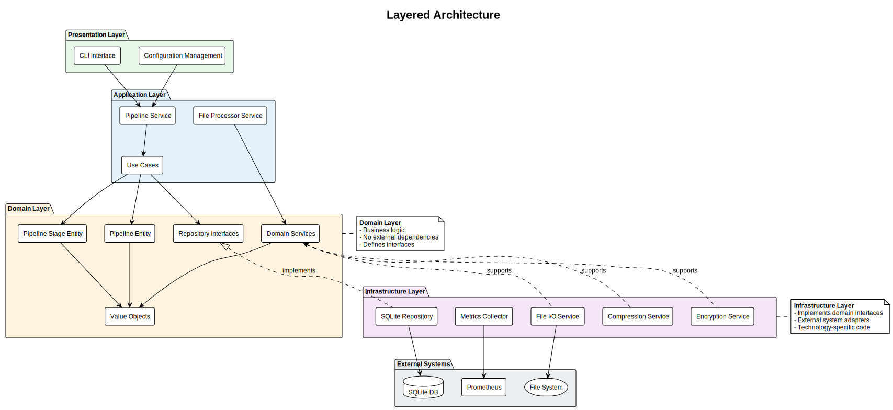

# Layered Architecture

**Version:** 1.0
**Date:** October 08, 2025
**SPDX-License-Identifier:** BSD-3-Clause
**License File:** See the LICENSE file in the project root.
**Copyright:** © 2025 Michael Gardner, A Bit of Help, Inc.
**Authors:** Michael Gardner, Claude Code
**Status:** Active

## Overview

The pipeline system is organized into four distinct layers, each with specific responsibilities and clear boundaries. This layered architecture provides separation of concerns, testability, and maintainability.



## The Four Layers

```text
┌─────────────────────────────────────────┐
│         Presentation Layer              │  ← User interface (CLI)
│  - CLI commands                         │
│  - User interaction                     │
└─────────────────┬───────────────────────┘
                  │ depends on
┌─────────────────▼───────────────────────┐
│         Application Layer               │  ← Use cases, orchestration
│  - Use cases                            │
│  - Application services                 │
│  - Commands/Queries                     │
└─────────────────┬───────────────────────┘
                  │ depends on
┌─────────────────▼───────────────────────┐
│           Domain Layer                  │  ← Core business logic
│  - Entities                             │
│  - Value objects                        │
│  - Domain services (interfaces)         │
│  - Business rules                       │
└─────────────────△───────────────────────┘
                  │ implements interfaces
┌─────────────────┴───────────────────────┐
│        Infrastructure Layer             │  ← External dependencies
│  - Database repositories                │
│  - File I/O                             │
│  - External services                    │
│  - Encryption/Compression               │
└─────────────────────────────────────────┘
```

## Dependency Rule

The **dependency rule** is the most important principle in layered architecture:

> **Dependencies flow inward toward the domain layer.**

- Presentation depends on Application
- Application depends on Domain
- Infrastructure depends on Domain (via interfaces)
- **Domain depends on nothing** (pure business logic)

This means:
- ✅ Application can use Domain types
- ✅ Infrastructure implements Domain interfaces
- ❌ Domain cannot use Application types
- ❌ Domain cannot use Infrastructure types

## Domain Layer

### Purpose

The domain layer contains the **core business logic** and is the heart of the application. It's completely independent of external concerns like databases, user interfaces, or frameworks.

### Responsibilities

- Define business entities and value objects
- Enforce business rules and invariants
- Provide domain service interfaces
- Emit domain events
- Define repository interfaces

### Structure

```
pipeline-domain/
├── entities/
│   ├── pipeline.rs           # Pipeline entity
│   ├── pipeline_stage.rs     # Stage entity
│   ├── processing_context.rs # Processing state
│   └── security_context.rs   # Security management
├── value_objects/
│   ├── algorithm.rs          # Algorithm value object
│   ├── chunk_size.rs         # Chunk size validation
│   ├── file_path.rs          # Type-safe paths
│   └── pipeline_id.rs        # Type-safe IDs
├── services/
│   ├── compression_service.rs    # Compression interface
│   ├── encryption_service.rs     # Encryption interface
│   └── checksum_service.rs       # Checksum interface
├── repositories/
│   └── pipeline_repository.rs    # Repository interface
├── events/
│   └── domain_events.rs      # Business events
└── error/
    └── pipeline_error.rs     # Domain errors
```

### Example

```rust
// Domain layer - pure business logic
pub struct Pipeline {
    id: PipelineId,
    name: String,
    stages: Vec<PipelineStage>,
    // ... no database or UI dependencies
}

impl Pipeline {
    pub fn new(name: String, stages: Vec<PipelineStage>) -> Result<Self, PipelineError> {
        // Business rule: must have at least one stage
        if stages.is_empty() {
            return Err(PipelineError::InvalidConfiguration(
                "Pipeline must have at least one stage".to_string()
            ));
        }

        // Create pipeline with validated business rules
        Ok(Self {
            id: PipelineId::new(),
            name,
            stages,
            // ...
        })
    }
}
```

### Key Characteristics

- **No external dependencies** - Only standard library and domain types
- **Highly testable** - Can test without databases or files
- **Portable** - Can be used in any context (web, CLI, embedded)
- **Stable** - Rarely changes except for business requirement changes

## Application Layer

### Purpose

The application layer orchestrates the execution of business use cases. It coordinates domain objects and delegates to domain services to accomplish specific tasks.

### Responsibilities

- Implement use cases (user actions)
- Coordinate domain objects
- Manage transactions
- Handle application-specific workflows
- Emit application events

### Structure

```
pipeline/src/application/
├── use_cases/
│   ├── process_file.rs       # File processing use case
│   ├── restore_file.rs       # File restoration use case
│   └── create_pipeline.rs    # Pipeline creation
├── services/
│   ├── pipeline_service.rs   # Pipeline orchestration
│   ├── file_processor_service.rs  # File processing
│   └── transactional_chunk_writer.rs  # Chunk writing
├── commands/
│   └── commands.rs           # CQRS commands
└── utilities/
    └── generic_service_base.rs  # Service helpers
```

### Example

```rust
// Application layer - orchestrates domain objects
pub struct FileProcessorService {
    pipeline_repo: Arc<dyn PipelineRepository>,
    compression: Arc<dyn CompressionService>,
    encryption: Arc<dyn EncryptionService>,
}

impl FileProcessorService {
    pub async fn process_file(
        &self,
        pipeline_id: &PipelineId,
        input_path: &FilePath,
        output_path: &FilePath,
    ) -> Result<ProcessingMetrics, PipelineError> {
        // 1. Fetch pipeline from repository
        let pipeline = self.pipeline_repo
            .find_by_id(pipeline_id)
            .await?
            .ok_or(PipelineError::NotFound)?;

        // 2. Create processing context
        let context = ProcessingContext::new(
            pipeline.id().clone(),
            input_path.clone(),
            output_path.clone(),
        );

        // 3. Process each stage
        for stage in pipeline.stages() {
            match stage.stage_type() {
                StageType::Compression => {
                    self.compression.compress(/* ... */).await?;
                }
                StageType::Encryption => {
                    self.encryption.encrypt(/* ... */).await?;
                }
                // ... more stages
            }
        }

        // 4. Return metrics
        Ok(context.metrics().clone())
    }
}
```

### Key Characteristics

- **Thin layer** - Delegates to domain for business logic
- **Workflow coordination** - Orchestrates multiple domain operations
- **Transaction management** - Ensures atomic operations
- **No business logic** - Business rules belong in domain layer

## Infrastructure Layer

### Purpose

The infrastructure layer provides concrete implementations of interfaces defined in the domain layer. It handles all external concerns like databases, file systems, and third-party services.

### Responsibilities

- Implement repository interfaces
- Provide database access
- Handle file I/O operations
- Implement compression/encryption services
- Integrate with external systems
- Provide logging and metrics

### Structure

```
pipeline/src/infrastructure/
├── repositories/
│   ├── sqlite_pipeline_repository.rs  # SQLite implementation
│   └── stage_executor.rs              # Stage execution
├── adapters/
│   ├── compression_service_adapter.rs # Compression implementation
│   ├── encryption_service_adapter.rs  # Encryption implementation
│   └── repositories/
│       └── sqlite_repository_adapter.rs  # Repository adapter
├── services/
│   └── binary_format_service.rs       # File format handling
├── metrics/
│   ├── metrics_service.rs             # Prometheus metrics
│   └── metrics_observer.rs            # Metrics collection
├── logging/
│   └── observability_service.rs       # Logging setup
└── config/
    └── config_service.rs              # Configuration management
```

### Example

```rust
// Infrastructure layer - implements domain interfaces
pub struct SQLitePipelineRepository {
    pool: SqlitePool,
}

#[async_trait]
impl PipelineRepository for SQLitePipelineRepository {
    async fn find_by_id(&self, id: &PipelineId) -> Result<Option<Pipeline>, PipelineError> {
        // Database-specific code
        let row = sqlx::query_as::<_, PipelineRow>(
            "SELECT * FROM pipelines WHERE id = ?"
        )
        .bind(id.to_string())
        .fetch_optional(&self.pool)
        .await
        .map_err(|e| PipelineError::RepositoryError(e.to_string()))?;

        // Map database row to domain entity
        row.map(|r| self.to_domain_entity(r)).transpose()
    }

    async fn create(&self, pipeline: &Pipeline) -> Result<(), PipelineError> {
        // Convert domain entity to database row
        let row = self.to_persistence_model(pipeline);

        // Insert into database
        sqlx::query(
            "INSERT INTO pipelines (id, name, ...) VALUES (?, ?, ...)"
        )
        .bind(&row.id)
        .bind(&row.name)
        .execute(&self.pool)
        .await
        .map_err(|e| PipelineError::RepositoryError(e.to_string()))?;

        Ok(())
    }
}
```

### Key Characteristics

- **Implements domain interfaces** - Provides concrete implementations
- **Database access** - Handles all persistence operations
- **External integrations** - Communicates with external systems
- **Technology-specific** - Uses specific libraries and frameworks
- **Replaceable** - Can swap implementations without changing domain

## Presentation Layer

### Purpose

The presentation layer handles user interaction and input/output. It translates user commands into application use cases and presents results back to the user.

### Responsibilities

- Parse and validate user input
- Execute application use cases
- Format and display output
- Handle user interaction
- Map errors to user-friendly messages

### Structure

```
pipeline/src/presentation/
├── presentation.rs           # Presentation module (Rust 2018+ pattern)
├── adapters.rs               # Adapter declarations
└── (CLI logic is in bootstrap crate)
```

### Example

```rust
// Presentation layer - CLI interaction
#[tokio::main]
async fn main() -> std::process::ExitCode {
    // 1. Parse CLI arguments
    let cli = bootstrap::bootstrap_cli()
        .unwrap_or_else(|e| {
            eprintln!("Error: {}", e);
            std::process::exit(65);
        });

    // 2. Set up dependencies (infrastructure)
    let db_pool = create_database_pool().await?;
    let pipeline_repo = Arc::new(SQLitePipelineRepository::new(db_pool));
    let compression = Arc::new(CompressionServiceAdapter::new());
    let file_processor = FileProcessorService::new(pipeline_repo, compression);

    // 3. Execute use case based on command
    let result = match cli.command {
        Commands::Process { input, output, pipeline } => {
            // Call application service
            file_processor.process_file(&pipeline, &input, &output).await
        }
        Commands::Create { name, stages } => {
            // Call application service
            create_pipeline_service.create(&name, stages).await
        }
        // ... more commands
    };

    // 4. Handle result and display to user
    match result {
        Ok(_) => {
            println!("✓ Processing completed successfully");
            ExitCode::SUCCESS
        }
        Err(e) => {
            eprintln!("✗ Error: {}", e);
            ExitCode::FAILURE
        }
    }
}
```

### Key Characteristics

- **Thin layer** - Minimal logic, delegates to application
- **User-facing** - Handles all user interaction
- **Input validation** - Validates user input before processing
- **Error formatting** - Converts technical errors to user-friendly messages

## Layer Interactions

### Example: Processing a File

Here's how the layers work together to process a file:

```text
1. Presentation Layer (CLI)
   ↓ User runs: pipeline process --input file.txt --output file.bin --pipeline my-pipeline
   ├─ Parse command-line arguments
   ├─ Validate input parameters
   └─ Call Application Service

2. Application Layer (FileProcessorService)
   ↓ process_file(pipeline_id, input_path, output_path)
   ├─ Fetch Pipeline from Repository (Infrastructure)
   ├─ Create ProcessingContext (Domain)
   ├─ For each stage:
   │  ├─ Call CompressionService (Infrastructure)
   │  ├─ Call EncryptionService (Infrastructure)
   │  └─ Update metrics (Domain)
   └─ Return ProcessingMetrics (Domain)

3. Domain Layer (Pipeline, ProcessingContext)
   ↓ Enforce business rules
   ├─ Validate stage compatibility
   ├─ Enforce chunk sequencing
   └─ Calculate metrics

4. Infrastructure Layer (Repositories, Services)
   ↓ Handle external operations
   ├─ Query SQLite database
   ├─ Read/write files
   ├─ Compress data (brotli, zstd, etc.)
   └─ Encrypt data (AES, ChaCha20)
```

## Benefits of Layered Architecture

### Separation of Concerns
Each layer has a single, well-defined responsibility. This makes the code easier to understand and maintain.

### Testability
- **Domain Layer**: Test business logic without any infrastructure
- **Application Layer**: Test workflows with mock repositories
- **Infrastructure Layer**: Test database operations independently
- **Presentation Layer**: Test user interaction separately

### Flexibility
You can change infrastructure (e.g., swap SQLite for PostgreSQL) without touching domain or application layers.

### Maintainability
Changes in one layer typically don't affect other layers, reducing the risk of breaking existing functionality.

### Parallel Development
Teams can work on different layers simultaneously without conflicts.

## Common Pitfalls

### ❌ Breaking the Dependency Rule

```rust
// WRONG: Domain depending on infrastructure
pub struct Pipeline {
    id: PipelineId,
    db_connection: SqlitePool,  // ❌ Database dependency in domain!
}
```

```rust
// CORRECT: Domain independent of infrastructure
pub struct Pipeline {
    id: PipelineId,
    name: String,
    stages: Vec<PipelineStage>,  // ✅ Pure domain types
}
```

### ❌ Business Logic in Application Layer

```rust
// WRONG: Business logic in application
impl FileProcessorService {
    pub async fn process_file(&self, pipeline: &Pipeline) -> Result<(), Error> {
        // ❌ Business rule in application layer!
        if pipeline.stages().is_empty() {
            return Err(Error::InvalidPipeline);
        }
        // ...
    }
}
```

```rust
// CORRECT: Business logic in domain
impl Pipeline {
    pub fn new(name: String, stages: Vec<PipelineStage>) -> Result<Self, PipelineError> {
        // ✅ Business rule in domain layer
        if stages.is_empty() {
            return Err(PipelineError::InvalidConfiguration(
                "Pipeline must have at least one stage".to_string()
            ));
        }
        Ok(Self { /* ... */ })
    }
}
```

### ❌ Direct Infrastructure Access from Presentation

```rust
// WRONG: Presentation accessing infrastructure directly
async fn main() {
    let db_pool = create_database_pool().await?;
    // ❌ CLI directly using repository!
    let pipeline = db_pool.query("SELECT * FROM pipelines").await?;
}
```

```rust
// CORRECT: Presentation using application services
async fn main() {
    let file_processor = create_file_processor().await?;
    // ✅ CLI using application service
    let result = file_processor.process_file(&pipeline_id, &input, &output).await?;
}
```

## Next Steps

Now that you understand the layered architecture:

- [Hexagonal Architecture](adapter-pattern.md) - Ports and adapters pattern
- [Dependency Inversion](dependencies.md) - Managing dependencies
- [Domain Model](domain-model.md) - Deep dive into the domain layer
- [Repository Pattern](repository-pattern.md) - Data persistence abstraction
