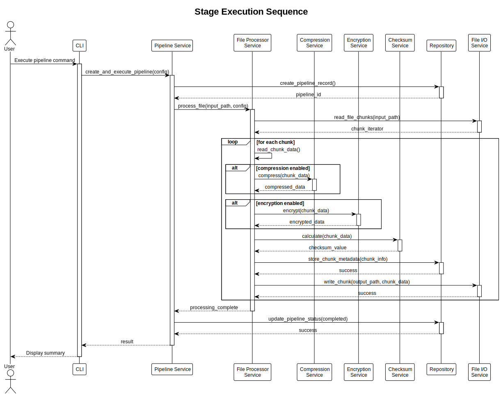

# Core Concepts

**Version:** 0.1.0
**Date:** 2025-01-04
**SPDX-License-Identifier:** BSD-3-Clause
**License File:** See the LICENSE file in the project root.
**Copyright:** © 2025 Michael Gardner, A Bit of Help, Inc.
**Authors:** Michael Gardner
**Status:** Draft

Essential concepts for understanding the pipeline.

## Key Terminology

### Pipeline
A complete file processing workflow with:
- **Unique ID**: Every pipeline has a ULID identifier
- **Input path**: Source file to process
- **Output path**: Destination for processed data
- **Stages**: Ordered list of processing steps
- **Status**: Created → Running → Completed (or Failed)

### Stage
An individual processing operation within a pipeline:
- **Type**: Compression, Encryption, or Integrity Check
- **Algorithm**: Specific implementation (e.g., Brotli, AES-256-GCM)
- **Sequence**: Order in the pipeline (1, 2, 3, ...)
- **Configuration**: Stage-specific settings

### File Chunk
A portion of a file processed independently:
- **Size**: Configurable (default 1MB)
- **Sequence**: Chunk number (0, 1, 2, ...)
- **Checksum**: Integrity verification value
- **Offset**: Position in original file

## Core Components

### Entities

**Pipeline Entity**
```rust
Pipeline {
    id: PipelineId,
    input_file_path: FilePath,
    output_file_path: FilePath,
    stages: Vec<PipelineStage>,
    status: PipelineStatus,
    created_at: DateTime,
}
```

**PipelineStage Entity**
```rust
PipelineStage {
    id: StageId,
    pipeline_id: PipelineId,
    stage_type: StageType,
    algorithm: Algorithm,
    sequence_number: u32,
}
```

### Value Objects

**FilePath** - Validated file system path
- Must exist (for input) or be writable (for output)
- Supports absolute and relative paths
- Cross-platform compatibility

**FileSize** - File size in bytes
- Human-readable display (KB, MB, GB)
- Validation for reasonable limits
- Efficient storage representation

**Algorithm** - Processing algorithm specification
- Compression: Brotli, LZ4, Zstandard
- Encryption: AES-256-GCM, ChaCha20-Poly1305
- Checksum: Blake3, SHA-256

## Data Flow

### Sequential Processing
Stages execute in order:

```
Input → Stage 1 → Stage 2 → Stage 3 → Output
```

### Parallel Chunk Processing
Chunks process independently:

```
Chunk 0 ──┐
Chunk 1 ──┼→ All go through stages → Reassemble
Chunk 2 ──┘
```

This enables:
- **Concurrency**: Multiple chunks processed simultaneously
- **Memory efficiency**: Only active chunks in memory
- **Scalability**: Leverage multiple CPU cores

### Pipeline Execution Sequence



1. **CLI** receives command
2. **Pipeline Service** creates pipeline
3. **File Processor** reads input file
4. For each chunk:
   - Apply compression (if enabled)
   - Apply encryption (if enabled)
   - Calculate checksum (always)
   - Store chunk metadata
   - Write processed chunk
5. Update pipeline status
6. Return result to user

## Domain Model

Our domain model follows Domain-Driven Design principles:


### Aggregates
**Pipeline Aggregate** - The root entity
- Contains Pipeline entity
- Manages associated FileChunks
- Enforces business rules
- Ensures consistency

### Relationships
- Pipeline **has many** PipelineStages (1:N)
- Pipeline **processes** FileChunks (1:N)
- FileChunk **belongs to** Pipeline (N:1)
- PipelineStage **uses** Algorithm (N:1)

## Processing Guarantees

### Integrity
Every chunk has a checksum:
- Calculated after processing
- Verified on read/restore
- Detects any corruption

### Atomicity
Pipeline operations are transactional:
- All stages complete, or none do
- Metadata stored consistently
- No partial outputs on failure

### Durability
Processed data is persisted:
- SQLite database for metadata
- File system for binary data
- Recoverable after crashes

## Next Steps

Continue to:
- [Pipeline Stages](stages.md) - Types of stages available
- [Configuration Basics](configuration.md) - How to configure pipelines
- [Running Your First Pipeline](first-run.md) - Hands-on tutorial
