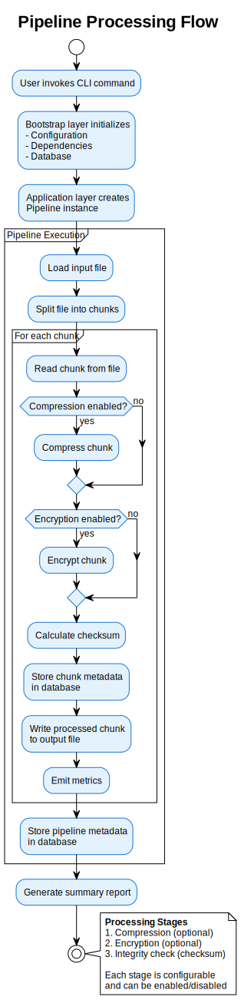

# What is a Pipeline?

**Version:** 0.1.0
**Date:** 2025-01-04
**SPDX-License-Identifier:** BSD-3-Clause
**License File:** See the LICENSE file in the project root.
**Copyright:** © 2025 Michael Gardner, A Bit of Help, Inc.
**Authors:** Michael Gardner
**Status:** Draft

Introduction to pipelines and their purpose.

## What is a Pipeline?

A **pipeline** is a series of connected processing stages that transform data from input to output. Each stage performs a specific operation, and data flows through the stages sequentially or in parallel.

Think of it like a factory assembly line:
- Raw materials (input file) enter at one end
- Each station (stage) performs a specific task
- The finished product (processed file) exits at the other end

## Real-World Analogy

### Assembly Line

Imagine an automobile assembly line:

```
Raw Materials → Welding → Painting → Assembly → Quality Check → Finished Car
```

In our pipeline system:

```
Input File → Compression → Encryption → Validation → Output File
```

Each stage:
- Receives data from the previous stage
- Performs its specific transformation
- Passes the result to the next stage

## Why Use a Pipeline?

### Modularity
Each stage does one thing well. You can:
- Add new stages easily
- Remove stages you don't need
- Reorder stages as needed

**Example**: Need encryption? Add an encryption stage. Don't need compression? Remove the compression stage.

### Reusability
Stages can be used in multiple pipelines:
- Use the same compression stage in different workflows
- Share validation logic across projects
- Build libraries of reusable components

### Testability
Each stage can be tested independently:
- Unit test individual stages
- Mock stage inputs/outputs
- Verify stage behavior in isolation

### Scalability
Pipelines can process data efficiently:
- Process file chunks in parallel
- Distribute work across CPU cores
- Handle files of any size

## Our Pipeline System

The Adaptive Pipeline provides:

**File Processing**: Transform files through configurable stages
- Input: Any file type
- Stages: Compression, encryption, validation
- Output: Processed `.adapipe` file
- Memory-mapped files for efficient processing of huge files

**Flexibility**: Configure stages for your needs
- Enable/disable stages
- Choose algorithms (Brotli, LZ4, Zstandard for compression)
- Set security levels (Public → Top Secret)

**Performance**: Handle large files efficiently
- Stream processing (low memory usage)
- Parallel chunk processing
- Optimized algorithms

**Security**: Protect sensitive data
- AES-256-GCM encryption
- Argon2 key derivation
- Integrity verification with checksums

## Pipeline Flow

Here's how data flows through the pipeline:



1. **Input**: Read file from disk
2. **Chunk**: Split into manageable pieces (default 1MB)
3. **Process**: Apply stages to each chunk
   - Compress (optional)
   - Encrypt (optional)
   - Calculate checksum (always)
4. **Store**: Write processed data and metadata
5. **Verify**: Confirm integrity of output

## What You Can Do

With this pipeline, you can:

✅ **Compress files** to save storage space
✅ **Encrypt files** to protect sensitive data
✅ **Validate integrity** to detect corruption
✅ **Process large files** without running out of memory
✅ **Customize workflows** with configurable stages
✅ **Track metrics** to monitor performance

## Next Steps

Continue to:
- [Core Concepts](core-concepts.md) - Key terminology and ideas
- [Pipeline Stages](stages.md) - Understanding stage types
- [Configuration Basics](configuration.md) - How to configure pipelines
