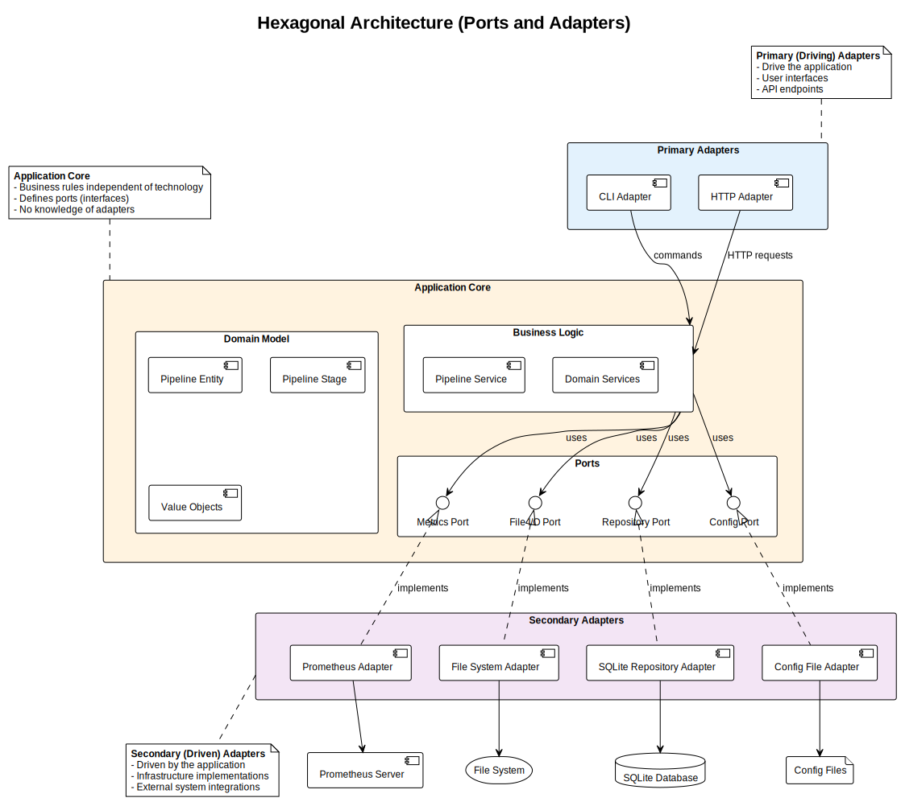

# Architecture Overview

**Version:** 0.1.0
**Date:** October 2025
**SPDX-License-Identifier:** BSD-3-Clause
**License File:** See the LICENSE file in the project root.
**Copyright:** © 2025 Michael Gardner, A Bit of Help, Inc.
**Authors:** Michael Gardner
**Status:** Draft

High-level architectural overview of the pipeline system.

## Design Philosophy

The Optimized Adaptive Pipeline is built on three foundational architectural patterns:

1. **Clean Architecture** - Organizing code by dependency direction
2. **Domain-Driven Design (DDD)** - Modeling the business domain
3. **Hexagonal Architecture** - Isolating business logic from infrastructure

These patterns work together to create a maintainable, testable, and flexible system.

## Layered Architecture

The pipeline follows a strict layered architecture where dependencies flow inward:


### Layer Overview

**Presentation Layer** (Outermost)
- CLI interface for user interaction
- Configuration management
- Request/response handling

**Application Layer**
- Use cases and application services
- Pipeline orchestration
- File processing coordination

**Domain Layer** (Core)
- Business logic and rules
- Entities (Pipeline, PipelineStage)
- Value objects (FilePath, FileSize, Algorithm)
- Domain services

**Infrastructure Layer** (Outermost)
- Database implementations (SQLite)
- File system operations
- External system adapters
- Metrics collection

## Clean Architecture

Clean Architecture ensures that business logic doesn't depend on implementation details:


### Key Principles

**Dependency Rule**: Source code dependencies point only inward, toward higher-level policies.

- **High-level policy** (Application layer) defines what the system does
- **Abstractions** (Traits) define how components interact
- **Low-level details** (Infrastructure) implements the abstractions

This means:
- Domain layer has **zero external dependencies**
- Application layer depends only on domain traits
- Infrastructure implements domain interfaces

### Benefits

✅ **Testability**: Business logic can be tested without database or file system
✅ **Flexibility**: Swap implementations (SQLite → PostgreSQL) without changing business logic
✅ **Independence**: Domain logic doesn't know about HTTP, databases, or file formats

## Hexagonal Architecture (Ports and Adapters)

The pipeline uses Hexagonal Architecture to isolate the core business logic:



### Core Components

**Application Core**
- Domain model (entities, value objects)
- Business logic (pipeline orchestration)
- Ports (trait definitions)

**Primary Adapters** (Driving)
- CLI adapter - drives the application
- HTTP adapter - future API endpoints

**Secondary Adapters** (Driven)
- SQLite repository adapter - driven by the application
- File system adapter - driven by the application
- Prometheus metrics adapter - driven by the application

### How It Works

1. **User** interacts with **Primary Adapter** (CLI)
2. **Primary Adapter** calls **Application Core** through defined ports
3. **Application Core** uses **Ports** (traits) to interact with infrastructure
4. **Secondary Adapters** implement these ports
5. **Adapters** connect to external systems (database, files)

**Example Flow**:
```
CLI → Pipeline Service → Repository Port → SQLite Adapter → Database
```

The application core never knows it's using SQLite - it only knows the `Repository` trait.

## Architecture Integration

These three patterns work together:

```text
Clean Architecture:    Layers with dependency direction
Domain-Driven Design:  Business modeling within layers
Hexagonal Architecture: Ports/Adapters at layer boundaries
```

**In Practice**:
- **Domain layer** contains pure business logic (DDD entities)
- **Application layer** orchestrates use cases (Clean Architecture)
- **Infrastructure** implements ports (Hexagonal Architecture)

This combination provides:
- Clear separation of concerns
- Testable business logic
- Flexible infrastructure
- Maintainable codebase

## Next Steps

Continue to:
- [Layered Architecture Details](layers.md) - Deep dive into each layer
- [Domain Model](domain-model.md) - Understanding entities and value objects
- [Design Patterns](patterns.md) - Patterns used throughout the codebase
